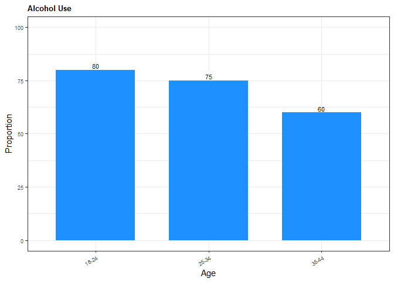
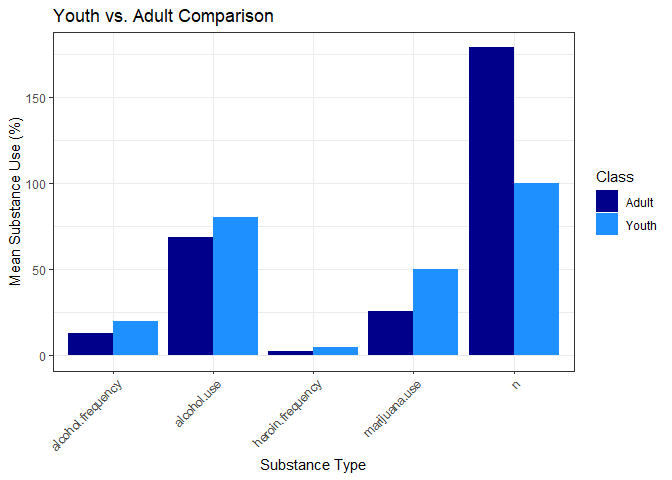

<!-- README.md is generated from README.Rmd. Please edit that file -->

# pkg.drugage

<!-- badges: start -->

[](https://github.com/DSCI-310-2025/pkg.drugage/actions/workflows/R-CMD-check.yaml)
[](https://app.codecov.io/gh/DSCI-310-2025/pkg.drugage)
[](https://dsci-310-2025.github.io/pkg.drugage/)

[](https://opensource.org/licenses/MIT)
[](https://creativecommons.org/publicdomain/zero/1.0/)
[](https://github.com/DSCI-310-2025/pkg.drugage/blob/main/DESCRIPTION)
[](https://github.com/DSCI-310-2025/pkg.drugage)
<!-- badges: end -->

The goal of `pkg.drugage` is to provide functions to streamline the
creation of data classification models. This package was originally
developed with the intention of creating a classificiation model able to
categorize data into youth vs. adult groups based on the trend of drug
use/frequency, but its functions can be applied to any similar scenario.

## Ecosystem Context

In the R ecosystem, `pkg.drugage` complements existing packages such as:

- **`tidymodels`**: While `tidymodels` offers a comprehensive framework
  for modeling, `pkg.drugage` provides convenience functions
  specifically tailored for classification workflows, including
  pre-processing steps and visualization helpers.
- **`caret`**: Similar to `caret`, `pkg.drugage` supports training and
  evaluating models, but focuses more narrowly on binary classification
  use cases and integrates more tightly with age-group classification
  logic.
- **`janitor`** and **`skimr`**: These offer data cleaning and summary
  tools, while `pkg.drugage` includes domain-specific cleaning for
  age-group classification in addition to generalized preprocessing.

Unlike broader frameworks, `pkg.drugage` prioritizes accessibility,
domain focus, and end-to-end reproducibility for education and research
scenarios.

## Functions

- `download_data`: Downloads a file from a given URL and saves it to a
  specified destination.
- `create_directory`: Checks if the specified directory exists, and
  creates the directory path if necessary.
- `data_cleaning`: Cleans the dataset, classifies individuals into age
  groups and saves the cleaned dataset to a given path.
- `eda_functions`: Performs exploratory data analysis (EDA) on the
  cleaned dataset, such as creating bar and scatter plots to visualize
  the raw data.
- `train_and_predict`: Takes a model specification and a recipe, fits
  the model on the training data, and returns class predictions on the
  testing data.
- `create_confusion_matrix`: Takes model predictions, generates a
  confusion matrix and saves it as a PNG figure and as a CSV table in
  the specified output directory. Returns the ggplot object used to
  create the plot.

## Dependencies

**R Dependencies**

- `docopt`: 0.7.1
- `dplyr`: 1.1.4
- `parsnip`: 1.3.1
- `pointblank`: 0.12.2
- `readr`: 2.1.5
- `recipes`: 1.1.1
- `rsample`: 1.2.1
- `tidyr`: 1.3.1
- `workflows`: 1.2.0

These dependencies will be automatically installed when running
`pak::pak("DSCI-310-2025/pkg.drugage")` to install the package.

## Installation

You can install the development version of pkg.drugage from
[GitHub](https://github.com/) with:

``` r
install.packages("pak")

pak::pak("DSCI-310-2025/pkg.drugage")
```

Then load the package:

``` r
library(pkg.drugage)
```

## Example

The following is a basic example which shows you how to use some of the
functions:

``` r
library(pkg.drugage)

# create sample data
sample_data <- data.frame(
 age = c("18-24", "25-34", "35-44"),
 alcohol.use = c(80, 75, 60),
 alcohol.frequency = c(20, 15, 10),
 marijuana.use = c(50, 30, 20),
 heroin.frequency = c(5, 3, 2),
 class = c("youth", "adult", "adult"),
 n = c(100, 200, 150))
 
# Clean data
cleaned_data <- clean_drug_use_data(sample_data)
classified_data <- classify_age_group(cleaned_data)
head(classified_data)
#>     age alcohol.use alcohol.frequency marijuana.use heroin.frequency class   n
#> 1 18-24          80                20            50                5 adult 100
#> 2 25-34          75                15            30                3 adult 200
#> 3 35-44          60                10            20                2 adult 150

# EDA
create_bar_use_plot(
sample_data,
"age",
"alcohol.use",
"Alcohol Use",
"Age",
"Proportion",
"dodgerblue",
"man/figures/README-test1.png")
```



``` r

sample_aggregated <- aggregate_data(sample_data)

create_grouped_bar_plot(
sample_aggregated,
"Youth vs. Adult Comparison",
"Substance Type",
"Mean Substance Use (%)",
"man/figures/README-test6.png"
)
```



## Code of Conduct

Please note that `pkg.drugage` is released with a [Code of
Conduct](https://dsci-310-2025.github.io/pkg.drugage/CODE_OF_CONDUCT.md).
By contributing to this project, you agree to abide by its terms.

## Licenses

This project is dual-licensed under the following:

- **[Creative Commons Zero v1.0 Universal (CC0
  1.0)](https://creativecommons.org/publicdomain/zero/1.0/)** You can
  copy, modify, distribute and perform the work, even for commercial
  purposes, all without asking permission.

- **[MIT License](LICENSE.md)**  
  A short and permissive software license. You can use it in proprietary
  software provided that all copies include the license terms and the
  copyright notice.
